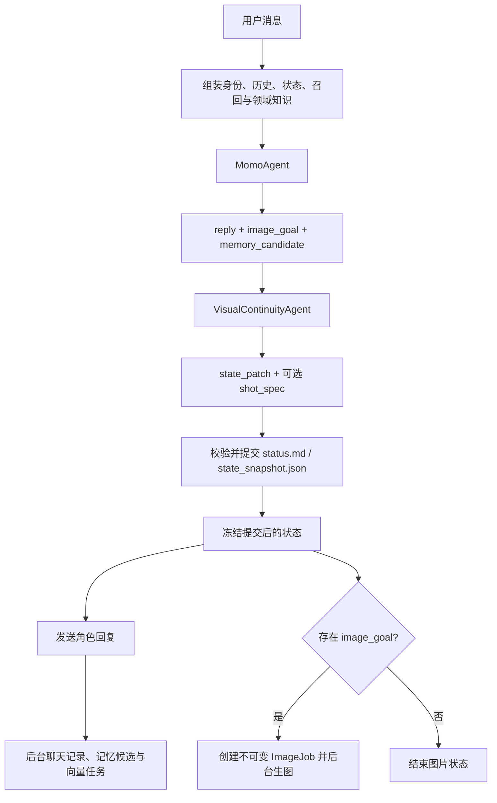

# AI_gf_momo 架构索引

> 修改模块职责、数据流、输出契约、配置入口、运行数据格式或验证方式时，必须同步更新本文档和 `AGENTS.md`。

## 系统边界

项目是多角色沉浸式聊天与 ComfyUI 生图应用。角色人格属于 `characters/<character>/identity.md`，由用户维护；通用运行协议属于 `config/agent.md`；全局领域知识位于 `config/knowledge/`。

正常持久化对话使用两个职责分离的同步模型步骤：

1. `MomoAgent` 专心完成角色决策和自然回复，只提出高层 `image_goal` 与长期记忆候选。
2. `VisualContinuityAgent` 每轮理解用户输入、角色实际回复和上一轮快照，更新服饰与场景；存在 `image_goal` 时还负责动作、姿势和镜头设计。

状态提交成功后才向用户发送角色回复，并以同一个冻结快照创建图片任务。MemoryAgent 的候选审核和 ComfyUI 生成仍在后台执行。

右侧“下一幕”面板通过独立的 `scene_transition` WebSocket 消息触发同一条事务链。自动模式由 MomoAgent 根据当前剧情推进，手动模式额外接收用户的场景构想；预设指令是隐藏任务，不伪装成用户台词，也不写入聊天记录。MomoAgent 输出已经发生的新一幕后，VisualContinuityAgent 从回复中还原新场景和实际穿着。默认不强制生图。事务成功后写入并发送持久化 `scene_divider` 事件，前端以“新场景”分割线展示。

## 顶层目录

| 路径 | 职责 |
| --- | --- |
| `backend/agents/` | Momo、视觉连续性、记忆和图片管线 |
| `backend/core/` | 运行时编排、上下文、状态与服饰模型、记忆策略、ImageJob |
| `backend/services/` | LLM、ComfyUI、提示词组装、TTS 等适配器 |
| `backend/tools/` | ImageJob 到 ComfyUI 工作流的工具封装 |
| `backend/api/` | HTTP 与 WebSocket 接口 |
| `characters/<id>/` | 用户维护的角色资料、状态、记忆、向量库和图片 |
| `config/` | 全局配置、Agent 协议、领域知识与工作流映射 |
| `scripts/` | 离线探针和烟雾测试 |

## 一轮消息的数据流



`AgentRuntime` 对同一角色加 `asyncio.Lock`，因此两轮状态解析和提交不会交错。VisualContinuity 输出先做无写入合并校验，再提交；连续性 JSON 或补丁无效时允许同一个 Agent 修复一次。两次均失败时，本轮不提交状态、不发送角色台词、不创建 ImageJob，只通过系统状态消息提示重试，避免角色说出“做到了”而实际状态未变。

关键入口：`backend/core/runtime.py`、`backend/agents/momo.py`、`backend/agents/image_director.py`、`backend/core/state.py`、`backend/core/wardrobe.py`、`backend/core/image_job.py`。

## MomoAgent 契约

新协议由 `config/agent.md` 约束：

```json
{
  "reply": "角色自然回复",
  "image_goal": {
    "purpose": "展示本轮结果",
    "subject": "需要呈现的对象",
    "visibility": "clear",
    "rating": "general"
  },
  "memory_candidate": null,
  "persist_context": true
}
```

MomoAgent 不输出 `state_ops`、服饰、场景或镜头标签。坐、站、躺、穿脱、换场景等事实只需自然地体现在 `reply`；`image_goal` 只表达是否要交付图片以及交付目的，不选择工作流、模型或提示词。每轮上下文中的 `status.md` 是上一轮视觉还原已经提交的客观事实；最近对话、记忆或角色惯性与其冲突时，主 Agent 必须以 `status.md` 为本轮起点，不得否认或凭空恢复视觉状态。解析器仍保留旧字段以兼容外部结构，但正常运行时会忽略旧 `state_ops/effects/image_intent/photo_prompt/state_updates`。

`persist_context=false` 用于不进入角色持久化链路的特殊回复，因此不会改状态、写历史或生图。

## VisualContinuityAgent 契约

协议位于 `config/image_director.md`，实现类为 `VisualContinuityAgent`；`ImageDirectorAgent` 名称只作为导入兼容别名保留。每个持久化回合都调用它，而不以是否生图为条件。

输入包括：

- 此前最多 8 轮结构化对话，用于理解剧情承接；
- 当前用户消息；
- Momo 实际 `reply`；
- 可选 `image_goal`；
- 上一轮完整服饰槽位、明确缺失标记、可见标签和场景标签；
- 本轮命中的领域知识。

最近剧情只补充动作承接、人物关系和观看目标，不能覆盖上一轮快照；本轮视觉变化仍以当前角色实际 `reply` 为主要依据。

输出包括：

```json
{
  "reason": "内部连续性判断摘要",
  "state_patch": {
    "wardrobe": {
      "footwear": {"mode": "replace", "layers": []}
    },
    "scene": null
  },
  "shot_spec": null
}
```

`state_patch` 每轮必填。没有变化时 `wardrobe={}`、`scene=null`；未出现的服饰槽位保持上一轮原样。被修改槽位使用 `mode=replace`，`layers` 是变化后完整的、从内到外排列的层级。场景确定发生变化时，以 `mode=replace` 提交变化后的完整场景标签。

只有 `image_goal` 存在时 `shot_spec` 才是对象，负责动作、姿势、表情、景别、角度、焦点、光线、rating 和一个可选强化组。它不包含服饰、场景、人物外观、质量、负面词、工作流或模型。

VisualContinuityAgent 会在固定协议后附加 `config/knowledge/visual_prompting.md`。该手册从 `data/pxlsan-标签选择器-完整内容.xlsx` 的服装、动作、构图、场景和光影栏目蒸馏而来，只保留组合规律、代表性词汇、few-shot、预算和冲突规则，不把原表数千行标签塞入每轮上下文。ShotSpec 限制为动作最多 3 个、姿势 2 个、表情 2 个、光线 2 个；场景替换最多 4 个标签。

## 服饰与状态模型

`state_snapshot.json` 是状态机、VisualContinuityAgent 和 ImageJob 使用的结构化事实源；`status.md` 不再维护旧的平铺服饰标签，而是由同一提交函数生成的可读投影。服饰区固定按“上身、下身、腿部、鞋子、配饰”展示，例如 `上身：topless`、`下身：white lace panties`。任何状态提交都必须同时更新两者，禁止再次写入 `white`、`lace`、`panties` 这类拆分服饰标签。

心情不是持久化视觉状态：`status.md`、`state_snapshot.json` 和前端状态栏均不保存或展示心情。旧 `status.md` 中以“心情状态”结尾的章节会在首次读取时自动移除；角色当下情绪和表情由最近剧情与当前回复自然表达，VisualContinuityAgent 需要生图时再据此设计表情。

服饰保持五个简化槽位：

| 槽位 | 内容 |
| --- | --- |
| `upper` | 上身层；Bra 为 `underwear`，上衣为 `outerwear` |
| `lower` | 下身层；内裤为 `underwear`，裙/裤为 `outerwear` |
| `legwear` | 袜、丝袜、连裤袜 |
| `footwear` | 鞋、靴、拖鞋等 |
| `accessories` | 首饰和配件 |

Bra 和内裤不是顶层槽位，而是 `upper/lower` 的内层类别。每件衣物从状态建模开始就使用一个精简短语，例如 `white_lace_panties`，而不是把颜色、材质和类型拆成互相独立的标签。这样既保留了用户要求的简单槽位，又能表达“脱掉内裤但裙子仍在”或“脱掉裙子后内裤成为可见层”。同一连体衣物可用相同 `id` 占据 `upper` 和 `lower`。

重要规则：

- 每个槽位从内到外排列；只替换本轮变化的槽位。
- `no_bra/no_panties` 仅保留为结构化快照中的隐藏内衣连续性事实，不进入前端或生图提示词。
- `footwear` 与 `legwear` 独立；两者都空时才投影 `barefoot`，但完全裸露时由 `completely_nude` 单独表达，不再重复 `barefoot`。
- 仅空上身/下身分别投影 `topless/bottomless`；四个衣物槽位均空时只投影 `completely_nude`，不再叠加 `topless`、`bottomless`、`no_bra` 或 `no_panties`。
- 未知旧标签进入 `legacy_visible`，原样保留并抑制不可靠的裸露推断。
- 旧 `apply_state_operations()`、`reduce_wardrobe()` 和 `state_updates_from_effects()` 保留作兼容入口，不参与新运行时主链路。

状态必须先提交，再创建 ImageJob。图片任务携带创建当时的快照，后台不得重新读取最新状态。

## ImageJob 与 ComfyUI

`ImageJob` 冻结角色、本轮回复、`image_goal`、`shot_spec`、动态画面标签、服饰、场景和状态版本。`build_image_prompt()` 统一注入角色视觉预设、冻结服饰的可见层、冻结场景和动态镜头标签。普通画面不使用权重；一个可选强化组以 `1.05-1.20` 编译。局部 `close-up/macro_shot` 配合部位焦点时，角色身份和裸露事实保持原权重，外貌细节与服饰整体自动编译为 `(..., ...:0.9)`，减少对局部主体的干扰；显式权重一律用圆括号，禁止 `[...:0.9]`。

工作流和模型由 `config/settings.json` 的全局 `comfyui` 配置决定。`root_dir` 指向本地 ComfyUI 根目录，工作流从 `<root_dir>/ComfyUI/user/default/workflows` 读取。前端空值继承工作流节点默认值，明确填写才覆盖。存在 `config/workflow_adapters/<workflow-stem>.json` 时只能改映射声明的受控节点。

`ComfyUIService.submit_and_wait()` 先连接同一 `client_id` 的 `/ws`，再提交 `/prompt`；收到完成事件后只读一次 `/history/{prompt_id}`，随后根据 history 返回的 `filename`、`subfolder` 和 `type` 调用 `/view`。有 SaveImage 时优先 `type=output`，只有 PreviewImage 时使用 `type=temp`。二进制预览帧不替代最终图片。

## 记忆和领域知识

`config/knowledge/router.json` 根据当前输入和最近对话选择领域手册，不调用 LLM。领域原则分别维护在 `wardrobe.md`、`scene.md`、`photography.md`、`intimacy.md` 和 `recall.md`，不要重新塞回 `agent.md`。

向量召回与长期记忆写入是两条独立链路：召回只为本轮提供参考；Momo 的 `memory_candidate` 只是候选，后台 `MemoryAgent` 审核、去重后才能刷新 `long_term.md`。实际刷新后，通过静默 `memory_updated` 消息通知前端。

## 服务地址和前端模式

根目录 `.env` 的 `SERVER_PORT` 是后端端口唯一来源。`启动.bat` 每次启动都会重新构建 Vue 页面、关闭 reload，并用随机查询参数打开地址，避免复用旧前端页面；`开发启动.bat` 启动 FastAPI reload 与 Vite，`frontend/vite.config.js` 从同一 `.env` 读取代理端口。前端源码变化后也可运行 `构建前端.bat` 或在 `frontend/` 执行 `npm run build`。

## 维护入口

| 调整目标 | 首选位置 |
| --- | --- |
| 角色回复与高层目标协议 | `config/agent.md`、`backend/agents/momo.py` |
| 视觉状态理解和 ShotSpec | `config/image_director.md`、`backend/agents/image_director.py` |
| 服饰槽位、层级和可见投影 | `backend/core/wardrobe.py` |
| 状态提交和 Markdown 投影 | `backend/core/state.py` |
| 领域规则与触发条件 | `config/knowledge/` |
| 精简视觉标签知识与 few-shot | `config/knowledge/visual_prompting.md` |
| ImageJob 和最终提示词 | `backend/core/image_job.py`、`backend/services/prompt_builder.py` |
| ComfyUI 工作流注入与传输 | `backend/services/comfyui.py`、`config/workflow_adapters/` |
| 角色人格 | `characters/<id>/identity.md`（仅用户明确要求时修改） |

## 验证命令

```powershell
py -m compileall -q backend scripts
py scripts/wardrobe_layer_probe.py
py scripts/turn_transaction_probe.py
py scripts/architecture_smoke.py
py scripts/memory_candidate_probe.py
py scripts/runtime_conversation_probe.py
py scripts/generation_settings_probe.py
py scripts/workflow_adapter_probe.py
py scripts/comfyui_transport_probe.py
py scripts/backend_smoke.py
git diff --check
```

`backend_smoke.py` 需要本地 ComfyUI；其余探针使用临时角色、假 LLM 或假 ComfyUI，不应读取或污染真实角色数据。
提示词拼接顺序约束：后端最终构建必须按“质量词（含 rating）→ 主体（角色标签、外貌、体型）→ 服饰 → 构图视角 → 姿势动作 → 环境与光线”排列；质量词和评级始终置于最前。
