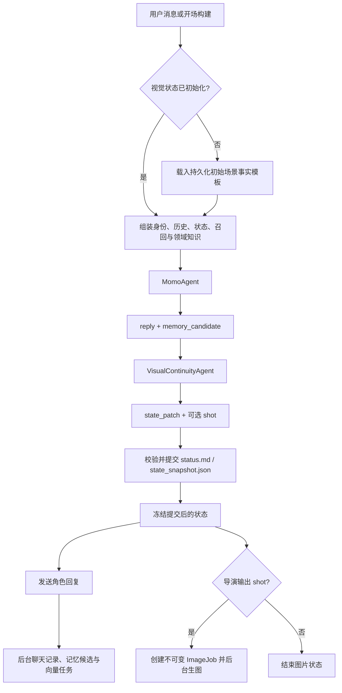

# AI_gf_momo 架构索引

项目级历史决策、已废弃方案和后续修改边界见 `docs/PROJECT_MEMORY.md`；本索引负责当前架构、契约和验证入口，二者配合阅读。

> 修改模块职责、数据流、输出契约、配置入口、运行数据格式或验证方式时，必须同步更新本文档和 `AGENTS.md`。

## 系统边界

项目是多角色沉浸式聊天与 ComfyUI 生图应用。角色人格属于 `characters/<character>/identity.md`，由用户维护；通用运行协议属于 `config/agent.md`；全局领域知识位于 `config/knowledge/`。

正常持久化对话使用两个职责分离的同步模型步骤：

1. `MomoAgent` 专心完成角色决策、剧情推进和沉浸式自然回复，只提出长期记忆候选。
2. `VisualContinuityAgent` 每轮理解用户输入、角色实际回复和上一轮快照，更新服饰与场景，并以 `shot` 是否为空同时决定是否生图和完成动作、姿势与镜头设计。

状态提交成功后才向用户发送角色回复，并以同一个冻结快照创建图片任务。MemoryAgent 的候选审核和 ComfyUI 生成仍在后台执行。

右侧“下一幕”面板通过独立的 `scene_transition` WebSocket 消息触发同一条事务链。自动模式由 MomoAgent 根据当前剧情推进，手动模式额外接收用户的场景构想；预设指令是隐藏任务，不伪装成用户台词，也不写入聊天记录。MomoAgent 输出已经发生的新一幕后，VisualContinuityAgent 从回复中还原新场景和实际穿着，并按新画面的表现价值决定是否生图。事务成功后写入并发送持久化 `scene_divider` 事件，前端以“新场景”分割线展示。

新角色与清空记录后的角色进入显式 `initialized=false` 状态，`status.md` 显示“未构建”；它表示尚无视觉事实，不能解释为裸体、空场景或任何默认服饰。角色的 `profile.json.initial_scene` 保存可随时编辑的开场事实模板（构想、开场方与修订号），与当前剧情状态分离：编辑模板不改变正在进行的剧情，清空记录也不会删除模板。玩家可以在右侧面板主动构建开场，也可以直接发送第一条消息触发自动构建。两种方式都走 MomoAgent → VisualContinuityAgent → 状态提交；VisualContinuityAgent 必须一次建立完整服饰槽位与包含时间、地点的场景，成功后才把 `initialized` 设为 `true`。模板只约束需要成立的事实，重新开场允许自然改写旁白、动作和服饰描述细节。开场内部指令不进聊天记录；历史顺序为“故事开始”分割线、可选真实玩家首句、角色开场。

新建角色时必须分别选择角色性别和玩家性别：角色性别保存到 `profile.json.gender`，玩家性别保存到角色目录下的 `user.json.gender`。两者作为关系与画面中的客观参与者事实进入 MomoAgent 和 VisualContinuityAgent；旧角色字段为空时保持“未设置”，不再暗中假设女性角色或男性玩家。设置页允许随后分别修改。

## 顶层目录

| 路径 | 职责 |
| --- | --- |
| `backend/agents/` | Momo、视觉连续性、记忆和图片管线 |
| `backend/core/` | 运行时编排、上下文、状态与服饰模型、记忆策略、ImageJob |
| `backend/services/` | LLM、ComfyUI、提示词组装、TTS 等适配器 |
| `backend/tools/` | ImageJob 到 ComfyUI 工作流的工具封装 |
| `backend/api/` | HTTP 与 WebSocket 接口 |
| `characters/<id>/` | 用户维护的角色资料、状态、记忆、向量库和图片 |
| `config/` | 全局配置、Agent 协议、领域知识与工作流映射 |
| `scripts/` | 离线探针和烟雾测试 |

## 一轮消息的数据流



`AgentRuntime` 对同一角色加 `asyncio.Lock`，因此两轮状态解析和提交不会交错。VisualContinuity 输出先做无写入合并校验，再提交；连续性 JSON 或补丁无效时允许同一个 Agent 修复一次。两次均失败时保持上一轮状态，不再追加模型调用，也不凭空构造新画面。

Momo 阶段的失败会按来源向前端发送安全、可行动的状态提示：上游安全策略拒绝、限流、超时、连接失败、鉴权失败、上下文拒绝、上游服务不可用和模型输出 JSON 格式异常分别显示。接口原始响应只写入后端日志，不发送到前端；接口成功但模型返回普通拒答文本而非 JSON 时，会被识别为安全策略拒绝或格式异常，而不会再笼统显示“角色回复生成失败”。

故事运行在独立的虚拟时空中。真实系统时间不再注入主 Agent 或 VisualContinuityAgent，也不参与剧情推进、场景判断、状态变化或“距上次聊天”的推断；聊天消息自身的技术时间戳仍由历史记录保留，用于前端显示和日志追踪。

MemoryAgent 同样不得接收现实日期、时钟或聊天技术时间。技术日期仅可在后台用于限定读取窗口和调度；传入候选审核与记忆沉淀模型的材料只保留对话顺序。长期记忆中的重要里程碑只能使用对话明确叙述的故事时间，或按已发生的故事先后排列，不得推断或补写现实日期。

主 Agent 的长期上下文由四层组成：`conversation_summary.md` 保存完整窗口之外的连续剧情，窗口预算内保留未压缩的完整对话，`long_term.md` 保存稳定长期事实，向量库按需召回细节。`context.compress_at` 达到阈值时，窗口选择器会在线性扫描中冻结即将退出窗口的完整消息；本轮回复继续执行，MemoryAgent 在后台把该片段与旧摘要合并。摘要正文与压缩游标先在 `memory_runtime.json` 中原子推进，再同步投影到 `conversation_summary.md`；每个角色只允许一个在途压缩任务，游标或摘要已经变化的过期结果会被丢弃。MemoryAgent 更新 `soul.md` 或 `long_term.md` 后立即清除 MomoAgent 对应的系统提示缓存。

上下文窗口和压缩阈值由前端“通用”设置统一配置：窗口允许 8K–1024K，阈值允许 0.50–0.95；后端保存时执行同样的范围规范化，并按“窗口 × 阈值”计算后台压缩触发点。

向量记忆按角色复用一个进程内 `VectorStore`，写入先进入每角色队列，再由一个后台任务按批落库；在下一轮需要召回时，尚未落库的队列内容也会作为临时候选参与检索。向量库清理每累计 50 条写入才运行一次。删除或清空角色记录前必须释放对应的向量缓存和待写入队列。领域路由配置、领域知识 Markdown 与 `settings.json` 使用文件修改时间缓存，文件被编辑后自动重新读取。

关键入口：`backend/core/runtime.py`、`backend/agents/momo.py`、`backend/agents/image_director.py`、`backend/core/state.py`、`backend/core/wardrobe.py`、`backend/core/image_job.py`。

## MomoAgent 契约

新协议由 `config/agent.md` 约束：

```json
{
  "reply": "角色自然回复",
  "memory_candidate": null,
  "persist_context": true
}
```

MomoAgent 不输出 `image_goal`、`state_ops`、服饰、场景或镜头标签。坐、站、躺、穿脱、换场景等事实只需自然地体现在 `reply`；旁白与角色台词同时存在时使用空行按语义分段，前端以 `white-space: pre-wrap` 保留该格式。每轮上下文中的 `status.md` 是上一轮视觉还原已经提交的客观事实；最近对话、记忆或角色惯性与其冲突时，主 Agent 必须以 `status.md` 为本轮起点，不得否认或凭空恢复视觉状态。解析器仍保留旧字段以兼容外部结构，但正常运行时会忽略旧 `image_goal/state_ops/effects/image_intent/photo_prompt/state_updates`。

`persist_context=false` 用于不进入角色持久化链路的特殊回复，因此不会改状态、写历史或生图。

## VisualContinuityAgent 契约

协议位于 `config/image_director.md`，实现类为 `VisualContinuityAgent`；`ImageDirectorAgent` 名称只作为导入兼容别名保留。每个持久化回合都调用它，而不以是否生图为条件。

输入包括：

- 此前最多 8 轮结构化对话，用于理解剧情承接；
- 当前用户消息；
- Momo 实际 `reply`；
- 上一轮从内到外的精简服饰槽位和场景标签；
- 角色与玩家的姓名、性别、主体和 POV 归属。

最近剧情只补充动作承接、人物关系和观看目标，不能覆盖上一轮快照；本轮视觉变化仍以当前角色实际 `reply` 为主要依据。

输出包括：

```json
{
  "reason": "内部连续性判断摘要",
  "state_patch": {
    "wardrobe": {
      "footwear": []
    },
    "scene": null
  },
  "shot": null
}
```

`state_patch` 每轮必填。没有变化时 `wardrobe=null` 或 `{}`、`scene=null`；未出现的服饰槽位保持上一轮原样。被修改槽位直接提交变化后的完整衣物短语数组并按从内到外排列，`[]` 表示清空；同一件连体衣物占据上下身时在两个槽位使用同一短语，后端合并为一个多槽位衣物对象。场景变化时直接提交变化后的完整精简标签数组。后端仍兼容旧 `mode/layers` 与 `mode/tags` 结构，但正常导演协议不再生成它们。

`shot` 本身就是导演的生图决定。明确观看意图且角色已实际呈现、明显服饰或场景变化、或性爱场景出现新的动作、接触或裸露结果时输出对象；日常对话、普通旁白、轻微姿势变化、普通寒暄、纯问答、重复状态，以及画面涉及接吻或拥抱的互动输出 `null`。镜头对象只包含 `camera/action/environment`：`camera.view` 合并景别与部位焦点且只选一个，`angle` 独立，`pov` 表示玩家视角；`action.tags/text` 负责姿势、动作、表情和必要的双方关系；`environment` 负责一个主要地点及可选光线或道具关系。导演不再接收或复述质量词、角色标签、体型和外貌。

状态事务与图片编辑错误分属不同失败边界。VisualContinuityAgent 的一次调用可以在协议错误后自行修复一次，但运行时不得为 state-only 或提示词兜底追加新的模型调用。镜头冲突、缺失 ShotSpec、提示词长度或自然语言格式应在导演的同次输出解析中降级处理；若两次输出仍无法可靠提交状态，则保持上轮冻结快照，不猜测未经验证的状态变化。

VisualContinuityAgent 会在固定协议后附加 `config/knowledge/visual_prompting.md`。该手册从通用服装、动作、构图、场景和成人场景资料蒸馏而来，不把原表注入上下文。导演先确定一个核心可见行为，再以必要姿势和镜头使它成立；自然语言采用省略主语的客观动宾短语，另一人使用 `a man/a woman` 等客观对象。构图中的景别与部位焦点二选一，角度可独立保留；性爱互动在更清楚表达双方关系时可选择玩家 POV。动作和环境短语只作柔性压缩，长度永远不能导致图片或整轮对话被取消。

## 服饰与状态模型

`state_snapshot.json` 是状态机、VisualContinuityAgent 和 ImageJob 使用的结构化事实源；`status.md` 不再维护旧的平铺服饰标签，而是由同一提交函数生成的可读投影。服饰区固定按“上身、下身、腿部、鞋子、配饰”展示，例如 `上身：topless`、`下身：white lace panties`。任何状态提交都必须同时更新两者，禁止再次写入 `white`、`lace`、`panties` 这类拆分服饰标签。

快照顶层的 `initialized` 区分“尚未构建”与真实的空服饰槽位。`initialized=false` 时 `wardrobe=null`，图片任务不会创建；只有初始场景事务提交了完整的 `upper/lower/legwear/footwear` 槽位和非空场景后，状态才切换为 `true`。旧角色若没有该字段，则根据既有 `status.md` 是否包含“未构建”进行保守兼容，不会被自动清空或迁移成新开场。

心情不是持久化视觉状态：`status.md`、`state_snapshot.json` 和前端状态栏均不保存或展示心情。旧 `status.md` 中以“心情状态”结尾的章节会在首次读取时自动移除；角色当下情绪和表情由最近剧情与当前回复自然表达，VisualContinuityAgent 需要生图时再据此设计表情。

服饰保持五个简化槽位：

| 槽位 | 内容 |
| --- | --- |
| `upper` | 上身层；Bra 为 `underwear`，上衣为 `outerwear` |
| `lower` | 下身层；内裤为 `underwear`，裙/裤为 `outerwear` |
| `legwear` | 袜、丝袜、连裤袜 |
| `footwear` | 鞋、靴、拖鞋等 |
| `accessories` | 首饰和配件 |

Bra 和内裤不是顶层槽位，而是 `upper/lower` 的内层类别。每件衣物从状态建模开始就使用一个精简短语，例如 `white_lace_panties`，而不是把颜色、材质和类型拆成互相独立的标签。这样既保留了用户要求的简单槽位，又能表达“脱掉内裤但裙子仍在”或“脱掉裙子后内裤成为可见层”。同一连体衣物可用相同 `id` 占据 `upper` 和 `lower`。

重要规则：

- 每个槽位从内到外排列；只替换本轮变化的槽位。
- `no_bra/no_panties` 仅保留为结构化快照中的隐藏内衣连续性事实，不进入前端或生图提示词。
- `footwear` 与 `legwear` 独立；两者都空时才投影 `barefoot`，但完全裸露时由 `completely_nude` 单独表达，不再重复 `barefoot`。
- 仅空上身/下身分别投影 `topless/bottomless`；四个衣物槽位均空时只投影 `completely_nude`，不再叠加 `topless`、`bottomless`、`no_bra` 或 `no_panties`。
- 未知旧标签进入 `legacy_visible`，原样保留并抑制不可靠的裸露推断。
- 旧 `apply_state_operations()`、`reduce_wardrobe()` 和 `state_updates_from_effects()` 保留作兼容入口，不参与新运行时主链路。

状态必须先提交，再创建 ImageJob。图片任务携带创建当时的快照，后台不得重新读取最新状态。

## ImageJob 与 ComfyUI

`ImageJob` 冻结角色、本轮回复、导演镜头方案、服饰、场景和状态版本。正常运行时的 `build_image_prompt()` 按固定优先级组合两类数据：后端读取的质量词、角色性别人数标签 `1girl/1boy`、完整 `role/body/appearance` 锚点与冻结服饰/裸露事实；导演输出的 `camera/action/environment`。最终顺序为质量 → 主体 → 服饰事实 → 构图视角 → 姿势动作 → 精简环境。画面主体始终只有角色，玩家不增加第二个人数标签。`rating:*` 已退出协议和最终提示词。约 40 个语义单元仅是面向 SDXL 的编辑目标，不是后端计数、截断或拒绝规则；后端只本地压缩超长动作/环境短语。第一阶段运行时会复用本轮已读取的聊天历史和最终 Momo 提示词，图片任务优先于低优先级持久化任务。

生图服务地址、工作流和模型由 `config/settings.json` 的全局 `comfyui` 配置决定。`base_url` 可填写任意实际的 ComfyUI HTTP API 地址（包括反向代理路径）；为空时才回退到环境变量默认的 `http://127.0.0.1:8188`。服务对象在地址变化后的下一次请求关闭旧 HTTP 客户端并重新连接。`root_dir` 指向本地 ComfyUI 根目录，工作流从 `<root_dir>/ComfyUI/user/default/workflows` 读取；`GET /api/settings/comfyui/workflows` 只列出该目录直接包含的 JSON 文件，前端用下拉选择而非手写文件名。前端空值继承工作流节点默认值，明确填写才覆盖。存在 `config/workflow_adapters/<workflow-stem>.json` 时只能改映射声明的受控节点。

`ComfyUIService.submit_and_wait()` 先连接同一 `client_id` 的 `/ws`，再提交 `/prompt`；收到完成事件后只读一次 `/history/{prompt_id}`，随后根据 history 返回的 `filename`、`subfolder` 和 `type` 调用 `/view`。有 SaveImage 时优先 `type=output`，只有 PreviewImage 时使用 `type=temp`。二进制预览帧不替代最终图片。

聊天区可以本地隐藏或重新显示全部图片，不影响图片历史。每张历史图片均可通过 `POST /api/image/regenerate` 重新生成：后端只读取该图片记录中保存的最终 prompt，不重新读取当前服饰或场景；成功后替换同一条图片历史记录和聊天中的图片 URL，不新增聊天回合。旧图片文件保留在本地，避免未经确认删除用户数据。

## 记忆和领域知识

`config/knowledge/router.json` 根据当前输入和最近对话选择领域手册，不调用 LLM。领域原则分别维护在 `wardrobe.md`、`scene.md`、`photography.md`、`intimacy.md` 和 `recall.md`，不要重新塞回 `agent.md`。

向量召回与长期记忆写入是两条独立链路：召回只为本轮提供参考；Momo 的 `memory_candidate` 只是候选，后台 `MemoryAgent` 审核、去重后才能刷新 `long_term.md`。实际刷新后，通过静默 `memory_updated` 消息通知前端。

## 服务地址和前端模式

根目录 `.env` 的 `SERVER_PORT` 是后端端口唯一来源。`启动.bat` 每次启动都会重新构建 Vue 页面、关闭 reload，并用随机查询参数打开地址，避免复用旧前端页面；`开发启动.bat` 启动 FastAPI reload 与 Vite，`frontend/vite.config.js` 从同一 `.env` 读取代理端口。前端源码变化后也可运行 `构建前端.bat` 或在 `frontend/` 执行 `npm run build`。

## 维护入口

| 调整目标 | 首选位置 |
| --- | --- |
| 角色回复与高层目标协议 | `config/agent.md`、`backend/agents/momo.py` |
| 视觉状态理解和 ShotSpec | `config/image_director.md`、`backend/agents/image_director.py` |
| 服饰槽位、层级和可见投影 | `backend/core/wardrobe.py` |
| 状态提交和 Markdown 投影 | `backend/core/state.py` |
| 领域规则与触发条件 | `config/knowledge/` |
| 精简视觉标签知识与 few-shot | `config/knowledge/visual_prompting.md` |
| ImageJob 和最终提示词 | `backend/core/image_job.py`、`backend/services/prompt_builder.py` |
| ComfyUI 地址、工作流注入与传输 | `backend/services/generation_settings.py`、`backend/services/comfyui.py`、`config/workflow_adapters/` |
| 角色人格 | `characters/<id>/identity.md`（仅用户明确要求时修改） |

## 验证命令

```powershell
py -m compileall -q backend scripts
py scripts/wardrobe_layer_probe.py
py scripts/turn_transaction_probe.py
py scripts/architecture_smoke.py
py scripts/memory_candidate_probe.py
py scripts/context_compression_probe.py
py scripts/performance_cache_probe.py
py scripts/llm_error_classification_probe.py
py scripts/runtime_conversation_probe.py
py scripts/generation_settings_probe.py
py scripts/workflow_adapter_probe.py
py scripts/comfyui_transport_probe.py
py scripts/backend_smoke.py
git diff --check
```

`backend_smoke.py` 需要本地 ComfyUI；其余探针使用临时角色、假 LLM 或假 ComfyUI，不应读取或污染真实角色数据。

亲密画面由导演在 `action_tags` 中选择一个实际发生的双方核心行为，并用短 `action_text` 补足双方接触或位置关系；普通日常旁白、轻微姿势或重复状态不单独触发生图。
根目录 `data/` 是通用资料目录，角色运行数据只位于 `characters/<角色>/`；启动、列角色、切换角色和角色 API 都不会扫描、移动或删除 `data/` 的内容。
提示词拼接顺序约束：后端最终构建必须按“质量词 → 主体（角色标签、外貌、体型）→ 服饰 → 构图视角 → 姿势动作 → 环境与光线”排列；质量词始终置于最前，不再生成 `rating:*`。
提示词规则的归属保持单一：`config/image_director.md` 只定义输入、状态补丁、生图判定和 ShotSpec 契约；`config/knowledge/visual_prompting.md` 只提供提示词编辑方法、代表性动作与构图知识。两者不重复注入同一套审美规则，长度目标只作编辑参考，不作为后端拦截条件。
业务知识文件目前仅作为保留资料，不再注入 MomoAgent 或 VisualContinuityAgent。两者分别使用角色协议、状态快照、对话上下文和 `config/knowledge/visual_prompting.md`；`config/knowledge/` 中的旧领域文件与路由配置暂不删除，后续可单独评估是否重新启用。
亲密画面提示词新增“身体重点”编辑原则：导演先确定用户真正关注的身体部位，再保留少量与动作和裸露状态直接相关的器官描述，避免泛化姿势或全身解剖标签抢占画面重点。
VisualContinuityAgent 的精简边界以数据契约为准：`image_director.md` 保留服饰短语数组、场景标签数组、完整初始场景和 `camera/action/environment` 的 JSON 示例；动作、构图和提示词审美只维护在 `visual_prompting.md`。未初始化快照向导演传递 `wardrobe=null`，不得把“尚未构建”投影成裸体。初始状态连续两次无法校验时，不发送回复、分割线或聊天记录，角色继续保持 `initialized=false`。
MomoAgent 以 JSON 为正常协议；若上游成功返回了足够长的正常角色旁白/台词但未包 JSON，则将其降级为 `reply`（记忆候选为空、持久化为 true）继续正常的视觉链路。`<think>` 内容永不展示；只有思考块且包含策略拒绝，或普通文本本身是策略拒绝时，归类为内容策略拒绝，不得回退成角色回复。
